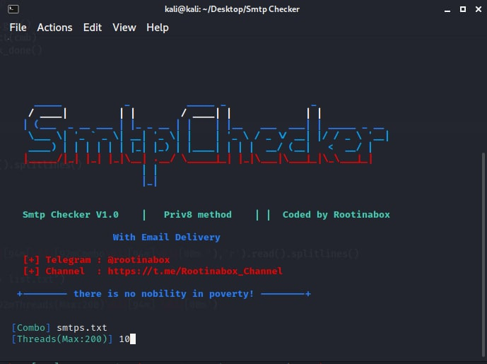

# Mass Smtps Checker


## What can it do?
This project aims to provide an easy-to-use python tool for checking smtps if they are working. This can be useful for handling many smtps in one time.

This tool however checks the smtps credentials and test their delivery to your email

---

## Requirements
* Python 2.7.14
* Smtps (host|port|user|pass)

---

**Linux**
```bash
apt install git python2-pip
git clone https://github.com/Rootinabox/Smtps-Checker/
cd Smtps-Checker
python2 smtpchecker.py
```
**Windows**
```
install python 2.7.14 ( add python to path )
python smtpchecker.py
```



## Issues & Features
If you find any problems or have a feature request, feel free to contact me.

Telegram : @rootinabox

Channel  : https://t.me/Rootinabox_Channel
---
